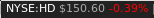

stock-widget
============

A basic stock ticker widget for awesome WM.



Inspiration taken from [deficient](https://github.com/deficient) widgets.

### Installation

First you need an API key from https://www.alphavantage.co/, and place it in `/opt/stock-widget/alphavantage`

```bash
cd ~/.config/awesome/
git clone git@github.com:whwright/stock-widget.git
```

Then, in your rc.lua:

```lua
local stock_widget = require("stock-widget")
stock = stock_widget({symbol = "NYSE:HD"})
-- add the widget to your wibox
{
    -- right widgets
    ...
    stock.widget
    ...
}
```

### Config

The text can be configured with the following properties

```lua
stock_widget({
    text_format = "${symbol_color_on}${symbol}${symbol_color_off} ${price_color_on}\$${price}${price_color_off} ${change_color_on}${change}%${change_color_off}",
    symbol_color = "white",
    price_color = nil,
    gain_color = "green",
    loss_color = "red",
    timeout = 60,
    get_stock_price_location = nil
})
```

`get_stock_price_location` is used to find the location of `get_stock_price.py`. By default, it will try to find the
script in your awesome config folder, or in the directory `stock-widget` in your awesome config folder (in case you
have cloned this repo as sub module). If that doesn't work for your use case, you can always override the directory containing the script with `get_stock_price_location`.
